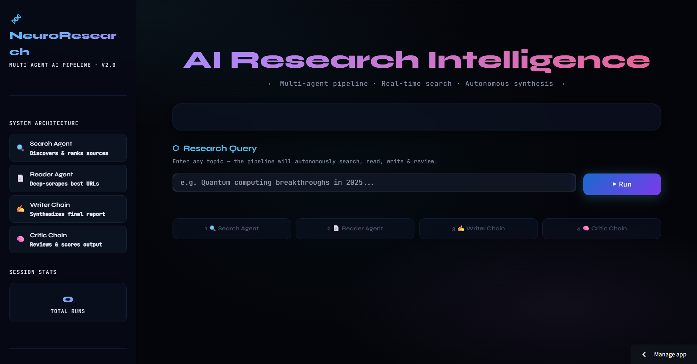
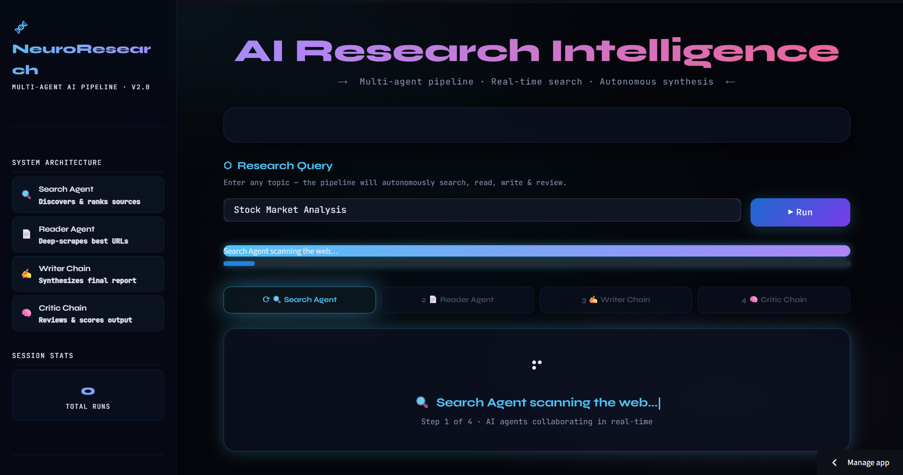
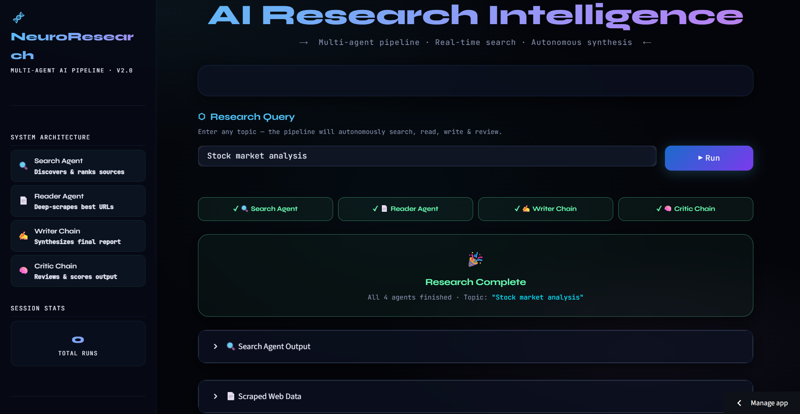
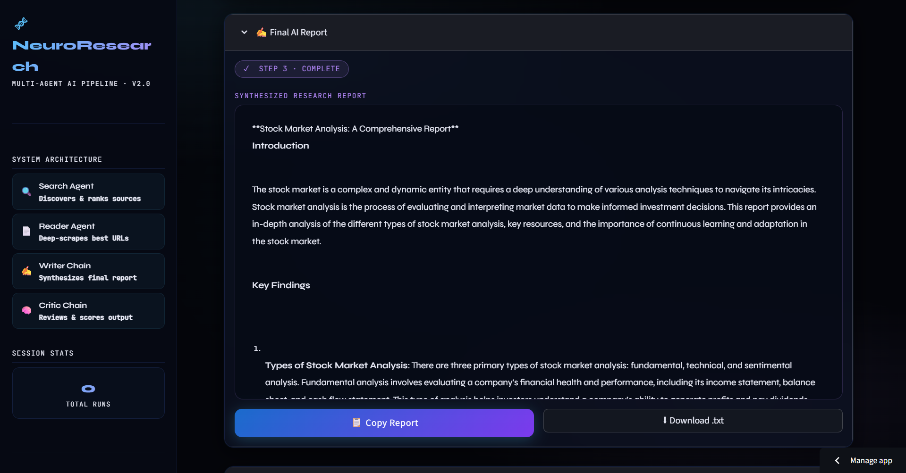
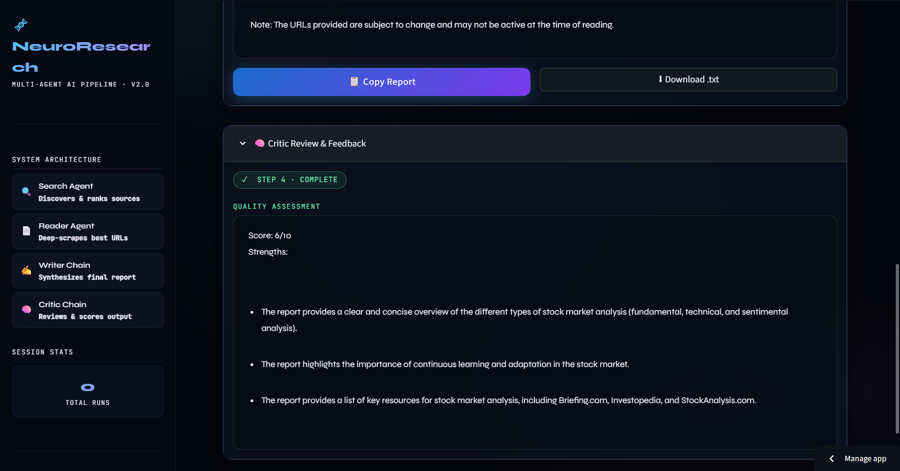

# Multi-Agent AI Research System

🔗 **Live Demo:** https://multi-agent-ai-research-system01.streamlit.app/

A practical multi-agent AI system that simulates how real research workflows work — where different AI agents collaborate to search, read, write, and critique information before producing a final report.

This project is built using **LangChain**, **Groq LLMs**, **Tavily API**, and Python-based tool orchestration. Instead of relying on a single prompt, it breaks the task into specialized agents working together in a structured pipeline.

---

## Screenshots

## 📸 Screenshots

### 🔹 Home Page


### 🔹 Search Process


### 🔹 Research Completion


### 🔹 Final Result


### 🔹 Critic Review


---

## What this project does

Given a research topic, the system automatically:

- 🔍 Searches the web for relevant and recent information  
- 🌐 Scrapes and extracts full content from the best sources  
- ✍️ Writes a structured, well-formatted research report  
- 🧠 Critically reviews the report and assigns a quality score  

All of this happens through a fully automated **multi-agent AI pipeline**, simulating a real-world research workflow.

---

## System Architecture

The workflow is designed like a real research assistant team, where each AI agent has a specialized role in the pipeline:

```bash
User Input (Topic)
        ↓
Search Agent → Finds relevant web results (Tavily)
        ↓
Reader Agent → Scrapes and extracts full article content
        ↓
Writer Chain → Generates structured research report
        ↓
Critic Chain → Reviews report and gives feedback + score
        ↓
Final Output (Report + Evaluation
```

---

## Project Structure

```bash
Multi-Agent AI Research System/
├── agents.py              # AI agents (search, reader, writer, critic)
├── pipeline.py            # Main orchestration logic
├── research_tools.py      # Web search + scraping tools
├── app.py                 # Streamlit UI (deployment entry point)
├── requirements.txt       # Dependencies
├── .env                   # API keys (Groq + Tavily)
├── .gitignore
├── .venv/
└── __pycache__/
```

---

## Tech Stack

- **LangChain** – Agent orchestration framework for building multi-agent workflows  
- **Groq LLM (Llama 3.1 8B Instant)** – High-speed inference model for generation and reasoning  
- **Tavily API** – Web search engine optimized for AI-powered applications  
- **BeautifulSoup** – Web scraping and structured text extraction from HTML pages  
- **Python** – Core backend logic and pipeline orchestration  
- **Streamlit** – Lightweight UI framework for deploying and interacting with the system

---

## Setup Instructions

### 1. Clone the repository
```bash
git clone https://github.com/your-username/Multi-Agent-AI-Research-System.git
cd Multi-Agent-AI-Research-System
```

### 2. Create virtual environment
```bash
python -m venv .venv
```
Activate it:
```bash
.venv\Scripts\activate
```

### 3. Install dependencies
```bash
pip install -r requirements.txt
```

### 4. Create a `.env` file in the root directory
In the root folder of your project, create a file named `.env` and add the following environment variables:

GROQ_API_KEY=your_groq_api_key
TAVILY_API_KEY=your_tavily_api_key

### 5. Run the project
```bash
streamlit run app.py
```

---

## How it works internally

### 1. Search Agent

The Search Agent uses the **Tavily API** to fetch relevant and up-to-date web results.

It extracts:

- 📰 Titles  
- 🔗 URLs  
- 📝 Snippets  

This ensures the system always works with **fresh and relevant web data**.

---

### 2. Reader Agent

The Reader Agent processes the URLs returned by the Search Agent.

It performs the following tasks:

- 🌐 Opens and reads each webpage  
- 🧹 Scrapes full article content  
- 🧼 Cleans raw HTML using **BeautifulSoup**  

The output is clean, structured text ready for the next stage in the pipeline.

---

### 3. Writer Chain

The Writer Chain is built using a **LangChain LCEL pipeline**:
```Prompt → LLM → Output Parser```

It takes the cleaned research data and generates a well-structured report containing:

- 📌 Introduction  
- 🔑 Key Findings  
- 🧾 Conclusion  
- 📚 Sources  

---

### 4. Critic Chain

The Critic Chain evaluates the final generated report and provides structured feedback:

- ⭐ Score (out of 10)  
- 💪 Strengths of the report  
- 🔧 Areas for improvement  
- 🧾 Final verdict on quality  

---

## Example Output Flow

```bash
Step 1: Search Agent → Collects web data  
Step 2: Reader Agent → Extracts full content  
Step 3: Writer → Generates structured report  
Step 4: Critic → Evaluates quality
```

## Key Features

- Multi-agent orchestration using LangChain  
- Real-time web search integration  
- Automated content scraping  
- Structured AI-generated reports  
- Built-in critic evaluation system  
- Modular and scalable architecture  

---

## Known Issues

- Groq API rate limits may affect heavy usage  
- Large queries may require retry logic  
- Scraping depends on website structure and may fail on dynamic sites  

---

## Future Improvements

- Add memory-based agent collaboration  
- Parallel agent execution for improved speed  
- UI dashboard using Streamlit  
- Export reports as PDF  
- Integrate vector database for long-term knowledge storage  
